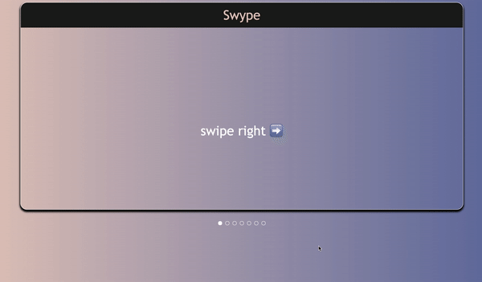

# Swype 
a simple card swipe component with indicators



# Install
```bash
npm i swype
```

# Usage
```js
import React from 'react';
import Swype from 'swype';

const cards = [
     {
        title: "card #1",
        content: "this is card #1"
    },
    {
        title: "card #2",
        content: "this is card #2"
    },
    {
        title: "card #3",
        content: "this is card #3"
    }
];

export const MyComponent = () => <Swype cards={cards} />;

```

# Storybook
run `npm run storybook` for a storybook version of the component.

# Features
* super simple
* multiple ways to navigate cards
* responsive
* auto adjusts according to content


WWWW